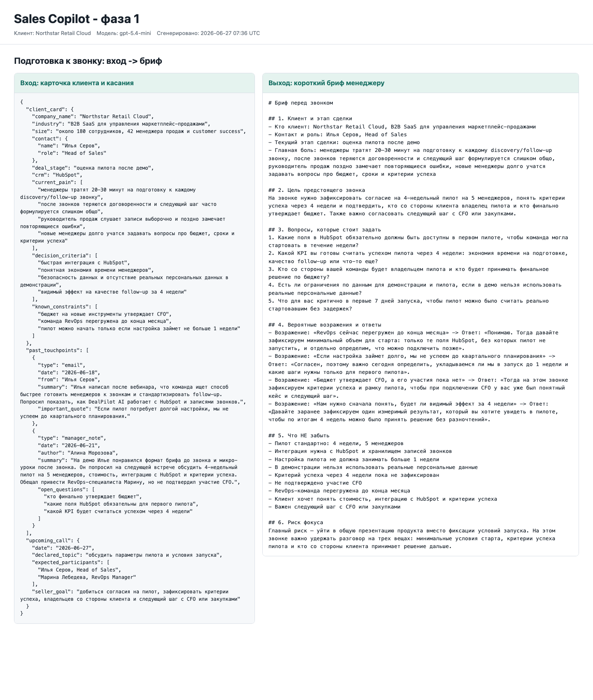
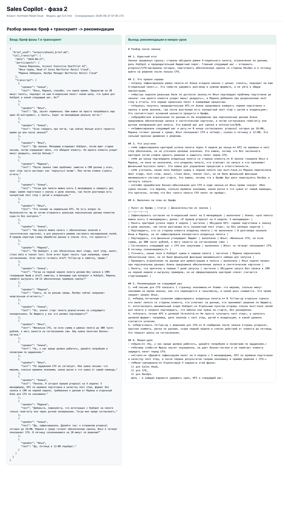
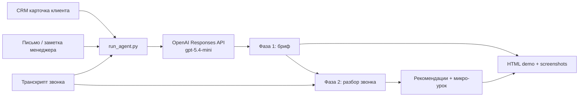

# Sales Copilot

Рабочий черновик AI-агента для менеджера продаж: подготовка к звонку и разбор звонка после встречи. Прототип сделан для одного синтетического B2B SaaS-клиента и показывает полный сценарий "бриф -> звонок -> разбор и микро-обучение".





## Быстрый ответ для проверяющего

- Рабочий прототип: `run_agent.py`.
- Использованная модель: `gpt-5.4-mini`.
- Две связанные фазы: `outputs/phase1_brief.md` передается в фазу 2.
- Промпты: `prompts/phase1_brief.md`, `prompts/phase2_review.md`.
- Короткая записка: `docs/submission_note.md`.
- Презентация: `docs/slides.md`.
- Мини-демо: `demo/demo.html` и PNG в `demo/screenshots/`.

## Что внутри

- `run_agent.py` - запускаемый CLI на стандартной библиотеке Python.
- `data/sample_client.json` - синтетическая карточка клиента, прошлые касания и транскрипт звонка.
- `prompts/phase1_brief.md` - промпт подготовки к звонку.
- `prompts/phase2_review.md` - промпт разбора после звонка.
- `outputs/phase1_brief.md` - live-результат фазы 1.
- `outputs/phase2_review.md` - live-результат фазы 2.
- `outputs/run_metadata.json` - модель, длительность и usage без секретов.
- `docs/submission_note.md` - короткая записка по заданию.
- `docs/slides.md` - 4 слайда для показа команде.
- `demo/demo.html` - статичный отчет "вход -> выход".
- `demo/phase1.html`, `demo/phase2.html` - страницы, из которых сделаны PNG-скриншоты.
- `demo/screenshots/phase1.png`, `demo/screenshots/phase2.png` - мини-демо для обеих фаз.

## Как запустить

1. Положить ключ OpenAI API в `.env`:

```bash
cp .env.example .env
# затем заменить значение OPENAI_API_KEY в .env
```

2. Запустить обе фазы:

```bash
python3 run_agent.py --input data/sample_client.json --out outputs --model gpt-5.4-mini
```

Скрипт читает `.env` локально, не печатает ключ и не сохраняет его в outputs.

Требования: Python 3.11+ и доступ к OpenAI API. Внешние Python-пакеты не нужны.

## Что делает агент

Фаза 1 берет карточку клиента и прошлые касания, затем готовит короткий бриф:

- кто клиент и на каком этапе сделки;
- цель звонка;
- 3-5 вопросов;
- вероятные возражения и ответы;
- что не забыть перед звонком.

Фаза 2 берет транскрипт состоявшегося звонка и бриф фазы 1, затем выдает:

- что прошло хорошо и что упустили;
- выполнен ли план из брифа;
- рекомендации на следующий раз;
- микро-урок в формате "было -> стало".

## Архитектура



## Тестовый live-прогон и стоимость

Live-прогон выполнен на `gpt-5.4-mini`; фактическая модель API: `gpt-5.4-mini-2026-03-17`. Скрипт прошел обе фазы на одном синтетическом клиенте: сначала сгенерировал бриф, затем передал этот бриф вместе с транскриптом в фазу 2 для разбора звонка.

Команда прогона:

```bash
python3 run_agent.py --input data/sample_client.json --out outputs --model gpt-5.4-mini
```

Результаты по `outputs/run_metadata.json`:

| Этап | Input tokens | Output tokens | Total tokens | Стоимость |
| --- | ---: | ---: | ---: | ---: |
| Фаза 1: бриф | 1,324 | 839 | 2,163 | `$0.0048` |
| Фаза 2: разбор | 2,910 | 1,556 | 4,466 | `$0.0092` |
| Полный цикл на 1 звонок | 4,234 | 2,395 | 6,629 | `$0.0140` |

Расчет сделан по заданным тарифам: `$0.75` за 1M input tokens и `$4.50` за 1M output tokens.

Формула:

```text
input_cost = 4,234 / 1,000,000 * 0.75 = $0.0031755
output_cost = 2,395 / 1,000,000 * 4.50 = $0.0107775
total_cost = $0.013953 ~= $0.014 на один звонок
```

Суммарная длительность live-прогона: 16.87 секунды.

## Проверка качества

Ручная проверка:

- фаза 2 использует бриф фазы 1 в таблице "Выполнен ли план из брифа";
- рекомендации привязаны к конкретному транскрипту и next steps;
- слабая фраза менеджера взята из звонка без выдумывания;
- факты вроде CFO, HubSpot, сроков и KPI совпадают с синтетическими входными данными.

## Минутный pitch менеджеру

Перед звонком агент за 3 минуты собирает для тебя главное: кто клиент, зачем звонок, какие вопросы задать, какие возражения вероятны и что нельзя забыть. После звонка он сравнивает разговор с планом, показывает, что было сделано, где провисли квалификация и next steps, и дает одну конкретную тренировку фразы. Это экономит время подготовки, дисциплинирует follow-up и ускоряет обучение менеджеров без прослушивания каждого звонка руководителем вручную.
